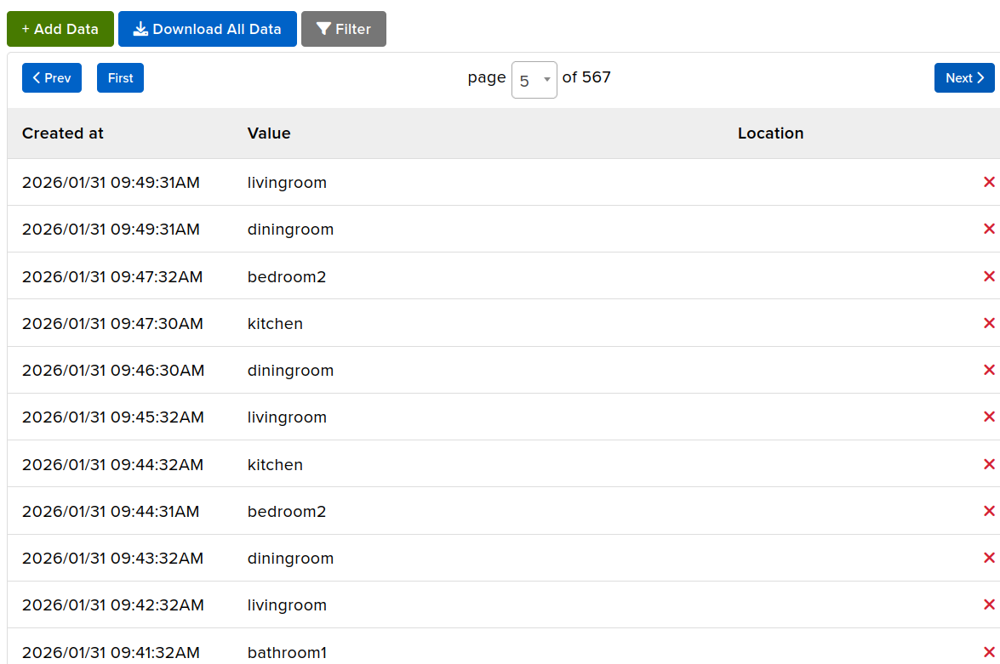
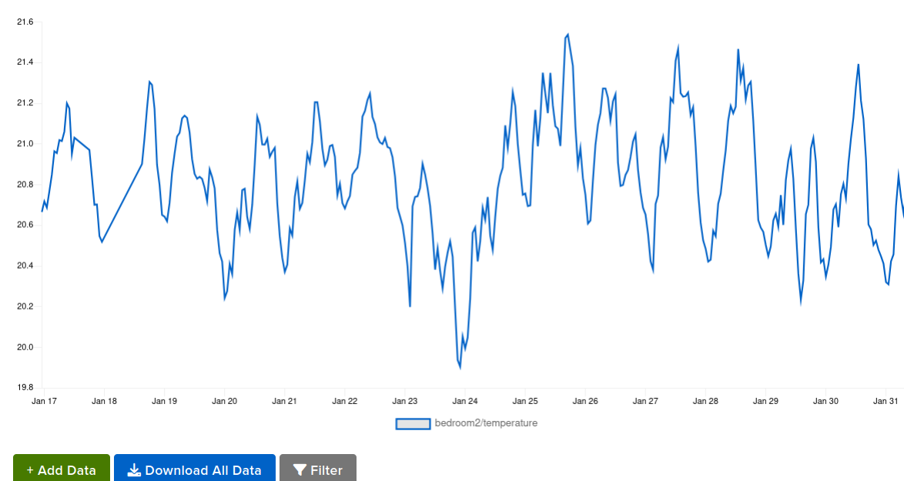

The goal of this project is to implement a collection of IoT devices around the house for remote monitoring of seniors aging in place or children returning from school. This is a low cost, open source, customizable solution for monitoring activities, alarms and alerts.

The strategy here is the use of MQTT as a central broker for reporting. We are monitoring:
  1. the occupants' movements (we assume a senior moving from room to room is doing okay), the report below shows more than one person's movements:
     
  3. the temperature, pressure and humidity of each room including outside (inside will have voc gas measurements) the following is a Grafana reporting compiled from adafruitio:
     
  5. additional mods needed to publish temperature, pressure, humidity and voc to dedicated feeds and generate graphs in the cloud in order to monitor trends and comfort level remotely, e.g.
     
  7. alerting the hearing impaired with blinking led if the doorbell message is received,
  8. more to come...

Minimal requirements: 
  1. Adafruit IO account (not neccesary but sufficient. You can use other MQTT brokers),
  2. one of these microcontrollers: Raspberry Pi Pico 2W, Pimoroni Pico Plus 2W, Adafruit ESP32 Feather v2,
  3. a mmWave detector (Waveshare mmWave), bosch BME688 or 690 or 280 (if voc is not needed.),

     
