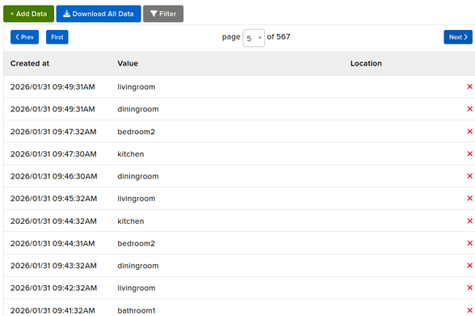
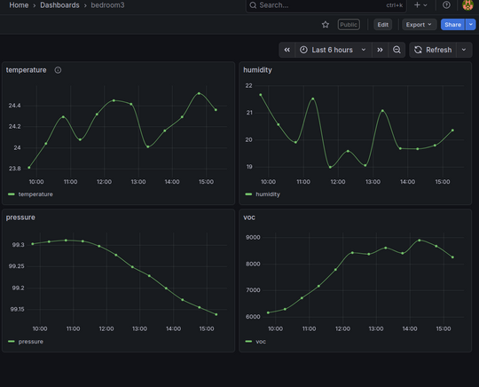
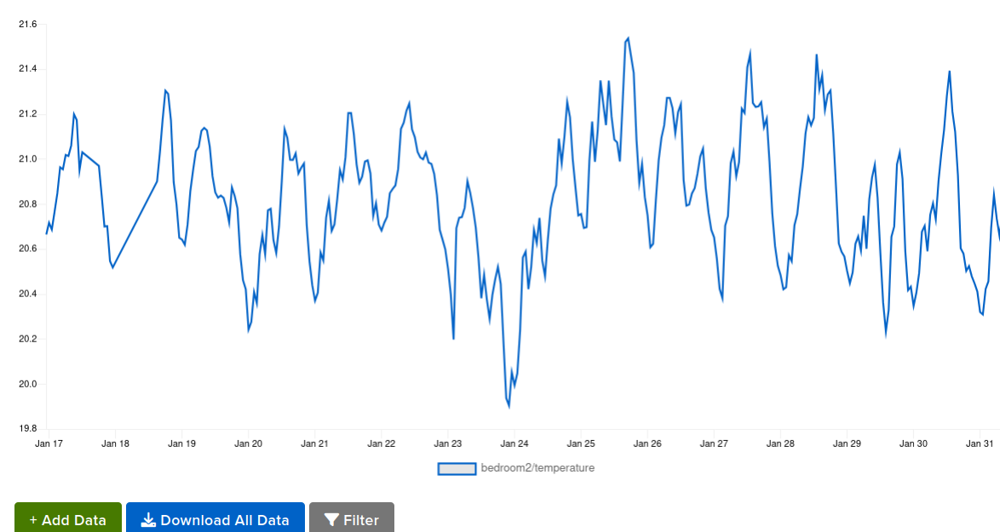

# WELLNESS MONITOR with IOT DEVICES

The goal of this project is to implement a collection of IoT devices around the house for remote monitoring activities of seniors aging in place/living alone or children returning from school. This is a low cost, open source, customizable solution for monitoring activities, alarms and alerts. We assume no pets.

## Assumptions
1. we assume a senior moving from room to room in his/her daily activity is relatively healthy.
2. No pets.

## Sample report:

 

## Organization

In each folder, there is a type of IoT device which will be used to collect movements. . It is necessary and sufficient to choose only one type of device. Most have bonus features such as environmental sensor, display, audio out, camera. Some have more features than others. A generic Raspberry Pi is the most flexible but most complicated.

> [!TIP]
> The most cost efficient is the RaspberryPi Pico 2W ~ $10 CAD, mmWave ~ $5 CAD, plus an old phone charger and a mqtt online broker for remote monitoring. Start [here](https://github.com/kp101/Wellness-Monitor/tree/50d20936e2d2d9d425f359b2aec37112ab954b6e/RaspberryPi-Pico2W).

The different types of devices have different advantages, e.g. Adafruit esp32 feather s3 is great for extended battery operations with deepsleep mode. e.g. gathering only temperature/pressure/humidity. Others have STEMMA/QT connecting to bme688 easily without soldering. For ease of maintainence, Micropython with a pico 2W is the most simple. 

>[!TIP]
>Environmental sensors are optional. They can be used to report temperature, pressure, humidity and voc.
>Displays are optional. They can tell you what the environment is or be used to provide messages for Doorbell for those with hearing impairments.

The strategy here is the use of MQTT as a central broker for monitoring:
  1. the occupants' movements (we assume a senior moving from room to room is doing okay), the report below shows more than one person's movements:
     

     
  3. Optionally, the temperature, pressure and humidity of each room including outside (inside will have voc gas measurements) the following is a Grafana reporting compiled and extracted from adafruitio:
     
     
     
  5. It is also possible to publish temperature, pressure, humidity and voc to dedicated feeds and generate graphs in the cloud in order to monitor trends and comfort level remotely (additional mods needed), e.g.
     
     
  7. The folder with Adafruit ESP32 Feather v2 has a publishing and listening feed. This additional listening feed is for alerting the hearing impaired with blinking led if the doorbell message is received (doorbell with camera and motion detection is in a separate folders to come.),
     
  9. more to come...

Minimal requirements: 
  1. Adafruit IO account (not neccesary but sufficient. You can use other MQTT brokers but a commercial broker has features to trigger alarms and send text/email in defined scenarios),
  2. one of these microcontrollers: Raspberry Pi Pico 2W, Pimoroni Pico Plus 2W, Adafruit ESP32 Feather v2,
  3. a mmWave detector (Waveshare mmWave), bosch BME688 or 690 or 280 (if voc is not needed.),

     
