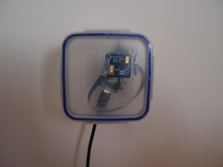
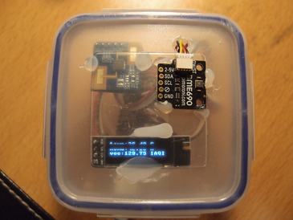

# Raspberry Pi Pico 2W + mmWave

The following is a "Micropython" implementation using a Raspberry Pi Pico 2W with a movement sensor to update an oline MQTT broker. 

The one on left is the basic version, the one on the right is the advanced version with additional environmental sensor and an oled display.

 

## Features
  1. Adjustable scanning periods,
  2. movement scanning and enviornmental readings,
  3. S.O.S. blinker if errors deteccted. it will do a soft reset subsequently,
  4. exception handling and reset if unresolved after retries,
  5. daily reboot in case of memory leaks,
  6. secured MQTT connection using 8883 port,
  7. Settings can be changed in config.yml.

## Hardware dependencies
  1. Raspberry Pi Pico 2W, 
  2. HMMD mmWave movement sensor refer:[mmWave](https://www.waveshare.com/wiki/HMMD_mmWave_Sensor),
  3. a 5v power adaptor (a used phone charger between 1A-2A is sufficient.), cable should be as short as possible to avoid brownout.

Optional advanced features:

  4. BME688 4-in-1 Air Quality Breakout (Gas, Temperature, Pressure, Humidity) refer: [bme688](https://shop.pimoroni.com/products/bme688-breakout?variant=39336951709779),
  5. STEMMA QT/Qwiic JST SH 4-pin Cable with Female Sockets (if BME688 with QWIIC connect was used). Otherwise, female connectors,
  6. OLED display with a SSD1306 controller.
  

## Software dependencies:
  1. Raspberry Pi Pico 2W image compiled by Pimoroni with added libraries. [RaspberryPi Pico 2W v1.26.1](https://github.com/pimoroni/pimoroni-pico-rp2350/releases/tag/v1.26.1)
  2. [umqtt.simple.py](./simple.py) (a tested and modified copy provided for convenience and consistency),
  3. [network_manager.py](./network_manager.py) (a tested copy provided for convenience and consistency),
  4. [yaml.py](./yaml.py) (a tested copy provided for convenience and consistency),
  5. [robust.py](./robust.py) (a tested copy provided for convenience and consistency),
  6. [ssd1306.py](./ssd1306.py) controller software for oled display.
Some of the above are reproduced here for version consistency. 

## Attaching mmWave Sensor
  1. TX pin 4 on PiPico is attached to RX pin on mmWave sensor,
  2. RX pin 5 on PiPico is attached to TX pin on mmWave sensor,
  3. 3.3v pin on PiPico is attached to 3.3v pin on mmWave sensor,
  4. GND pin on PiPico is attached to GND pin on mmWave sensor.

> [!CAUTION]
> This sensor consume approx. 40mA, too much to be running on batteries. 

## Attaching Bosch's BME688 sensor over I2C without STEMMA QT/QWIIC JST
  1. Attach pin 22 on PiPico to 2-6v pin(RED) on bme688,
  2. attach pin SDA (pin 2) on PiPico to SDA(BLU) pin on bme688,
  3. attach pin SCL (pin 3) on PiPico to SCL(YEL) pin on bme688,
  4. attach pin GND on PiPico to GND pin(BLK) on bme688,
  5. depending on what else is attached to I2C, there is a secondary address for bme688 (see config.yml).

> [!NOTE]
> This sensor consumes ~15mA. We are treating the bme688 as if it was a LED light by pulling this pin (22) HIGH to power it.
> This sensor also has a heater. When new, it should have a break-in period and a scan period meeting the requirements of Bosch for accuracy.
> Check Bosch website for further information.

## Communicating with Adafruit IO's MQTT:
  1. SSL=True is needed to use port 8883 for secured connection (there is a version of umqtt.Simple that imports uSSL which doesn't work in this firmware.)
  2. leave client_id="" to avoid collision on multiple client with same client_id triggering random disconnects. (don't ask me how I know.)
  3. when sending JSON to Adafruit IO mqtt, 'value={"xxx":yy}' is needed. Otherwise, send number and text directly.
alternative to mqtt, it is also possible to use the restful api on Adafruit IO.

## Installation Instructions:
  1. For brand new Pico2W hold reset and connect usb to computer, wait for drive to show and copy pimoroni firmware listed above to usb drive. It will reset.
  2. open Thonny, create new files and copy contents into each file and save with same name on device.
  3. change parameters in config.yml
  4. save and test.

> [!CAUTION]
> There is an outstanding but unknown defect causing it to freeze after a few months of operations. Unplug/replug to resolve. Investigation is ongoing.
