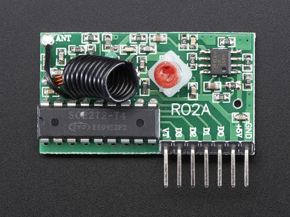
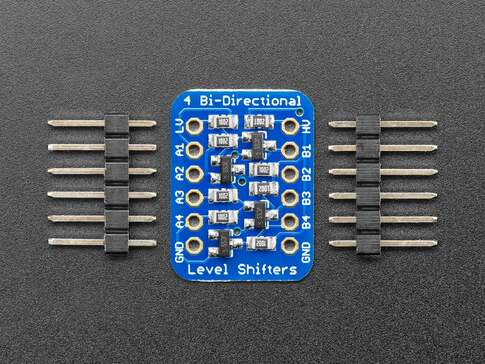

# RASPBERRY PI 2B + PANIC BUTTON

This project is to be used with an online MQTT broker, a Raspberry Pi, a level shifter, a remote button and a remote receiver. 
>[!CAUTION]
>This alarm is not commercial grade, It is only for non-critical alerts. Medical emergencies such as heart attacks and stokes should be directed to local emergency services without delay.

## Purpose
Pressing a remote button will send a message to a designated mqtt online feed. This online feed will automatically trigger a SMS, email to designated receipient(s). An external listener maybe added to audibily confirm the message was received by the online MQTT broker. For futher detail, see listener project. 

This is a part of a remote monitoring scheme. It's an alternative to commercial service where not available, too expensive, lacking privacy, not customizable or unreliable. The only thing this solution depends on is relaible electrical power, internet service and a MQTT broker with message forwarding capabilities.

Possible candidates: seniors without heart or stoke risks, falling and unable to get up but no fracture risks. In some remote areas, attentive neighours can be put on alert and reach the candidate faster than emergency response teams.

## Why a remote button? 
A remote button is small, light, does not require regular charging, can be carry around the neck, in the pocket or attached to a belt with a carabiner. No dialing, no fiddling with a phone.
   
## Required Hardware
- A remote button capable of transmitting with a matching receiver capable of receiving signal within a household boundary. This is a Simple RF T4 Receiver - 315MHz Toggle Type.
  

>[!IMPORTANT]
>To ensure reliable response, it is important to make sure sufficient voltage is fed to the receiver and the level shifter.

- The following level shifter was used for interfacing with the Pi's 3.3v pins to the 5v pins from the button receiver. Other solutions are possible. e.g. This particular level shifter is a bit slower, other faster products are available.
  

## Software dependencies

1. WiringPi library, (see install_wiringpi.txt),
2. paho-mqtt library. (see install_paho.txt),

> [!CAUTION]
> A word on communicating with Adafruit IO's MQTT. Leave client_id="" or use UUID to avoid random disconnects using same client_id with multiple clients. (don't ask me how I know.)
> when sending JSON to Adafruit IO mqtt, 'value={"xxx":yy}' is needed. Otherwise, send only number and text. 
> alternative to mqtt, it is also possible to use the restful api on Adafruit IO.

## Attaching Pi to level shifter to RF receiver

1. Connect a 3.3v pin on Pi to LV pin on level shifter, 
2. connect a ground pin on Pi to GND on the LV side of level shifter,
3. connect a digital pin on Pi (pin 23) to A1,
4. provide 5v to RF receiver +5V pin from power source,
5. provide 5v to HV pin on level shifter,
6. connect ground to RF receiver GND pin and GND on the HV side of level shifter,
7. connect D0 to B1 on level shifter.
  
## Compiling and Installation Instructions

1. Minimum customization should be made to panicbutton.h, mqtt.h and panicbutton.service. Then compile with Makefile, 
2. Once sucessfully compiled:
- sudo cp the panicbutton.service file to /etc/systemd/system directory,
- sudo systemctl enable panicbutton,
- sudo systemctl start panicbutton.
3. If available, setup a trigger to send sms/email to your mobile phone. See folder [adafruitio](https://github.com/kp101/Wellness-Monitor/tree/636922cb02e7a41db3aebd5636ba524562163901/adafruitio) for details. More details are in Adafruitio. Other provider may provide the same service but different methods.
  
## Verify
- Press the button,
- login to your mqtt broker account to verify data were posted,
- and if a trigger was added to send sms or email verify the result. The trip should take less than 2 seconds.
