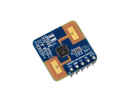

# RASPBERRY PI + MMWAVE

This is a implementation of a c program to detect movements within a room or hallway and report it an external mqtt broker. This was tested with Pi Zero W/2W, 2B/3B/3B+.



## Features

- Adjustable scanning interval,
- publishing movement detection data to a mqtt broker. 
- secured MQTT connection using 8883 port,
- Settings can be changed in mqtt.h and sensor.h headers prior to compiling.

## Hardware dependencies

1. mmWave refer: [HMMD_mmWave](https://www.waveshare.com/wiki/HMMD_mmWave_Sensor)
2. a cable with female connectors from sensor to Pi,
3. a 5v power adaptor (a used phone charger approx 2.5A is sufficient.), cable should be as short as possible to avoid brownout.
4. Minimum: Raspberry Pi ZeroW  or Pi Zero2W.

## Software dependencies

1. WiringPi library, See [install_wiringpi.md](./install_wiringpi.md),
2. paho-mqtt library. See ,
3. enable serial port:
```
sudo raspi-config
```
5. edit /boot/firmware/config.txt to disable BT by adding the following:
```
dtoverlay=disable-bt
```
7. Then reboot:
```
sudo reboot
```

> [!CAUTION]
> Leave client_id="" or use UUID to avoid random disconnects. Using same client_id with multiple devices on a MQTT broker is not a good idea. 
> when sending JSON to Adafruit IO mqtt, 'value={"xxx":yy}' is needed. Otherwise, send only number and text. 
> alternative to mqtt, it is also possible to use the restful api on Adafruit IO.
    
## Attaching mmWave 

1. Connecting the Pi to the HMMD_MMWAVE sensor as follows: 
- GND = GND, 
- 3.3v = 3.3v, 
- TX = RX, 
- RX = TX. 
  
> [!NOTE]
> The TX pin on Pi goes to RX pin on sensor and similarly for RX pin on Pi.

## Compiling and Installation Instructions

1. Minimum customization should be made to proximity.h, mqtt.h and bme68x.service. Then compile with Makefile, 
2. Once sucessfully compiled, setup service in systemd:
```
sudo cp the proximity.service file to /etc/systemd/system directory.
sudo systemctl enable proximity,
sudo systemctl start proximity.
```
   
## Verify
- login to your mqtt broker account to verify data are posting. By default it is 30 minutes intervals.
