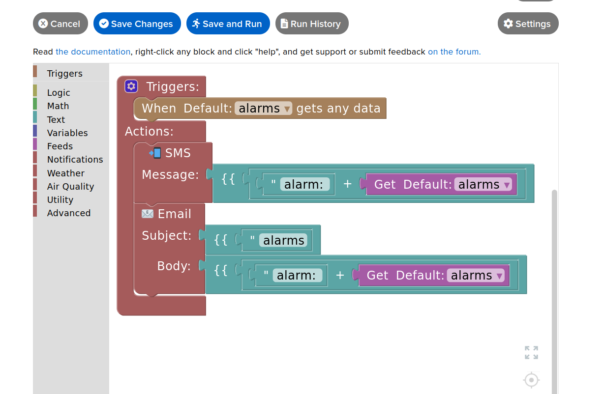
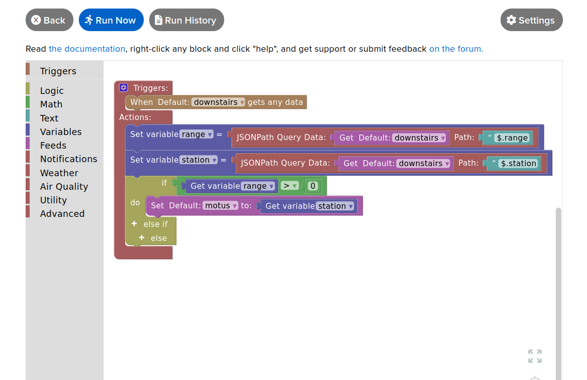

This part of documentation regards the role and programing of Adafruitio 'Actions'.

<b>Creating SMS Text/Email Notification</b>

When the 'alarms' feed received any data, a SMS text message and Email will be send.

<b>Redirecting A JSON Payload</b>

When the a json payload is send into the 'downstairs' feed, this Action will examine the range value. if the range is > 0, it then extracts the station name and put it into the 'motus' feed. 

The JSON payload in the 'downstairs" feed looks like this { "range": 233, "station": "kitchen" }.

To read more about json path query, please read the following...

reference: https://www.rfc-editor.org/rfc/rfc9535
