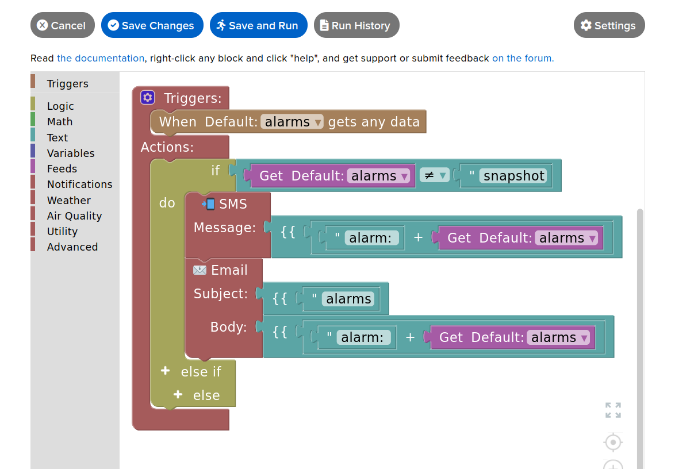

This part of documentation regards the role and programing of Adafruitio 'Actions'.

<b>Creating SMS Text/Email Notification</b>

This is for sending an text message or email message when a payload is recieved in a MQTT feed.

