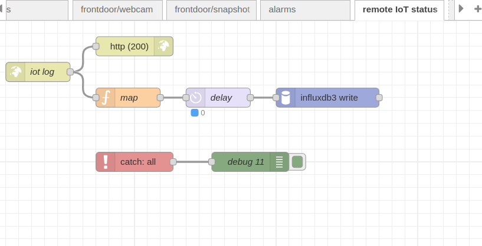
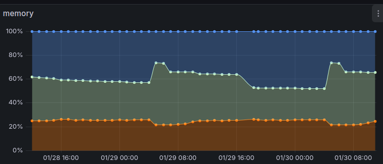

This is a set of routines (client/server) to collect iot status as data point for monitoring over time. 

The IoT clients are tested for Raspberry Pi 2B/3B+/4B/Zero 2W. Others should work but not tested. Note:
  - sudo apt install sysstat to add dependency, awk, df, free should be already installed;
  - the client shell script is in BASH syntax and can be place anywhere in user home directory;
  - this script assumes a boot and system partition as created by the RaspberryPi Foundation Application. For other setup such as usb drive or ssd memory, modifications are required;
  - scheduled via crontab -e on a periodic basis for execution. No root privileages are required. Be sure to enter the final location of your script;
  - The script will gather data points and do a 'http get' to report on the server of your choice. Please edit the script to replace the server domain name/ip/port address;

On the server side, the server stack is node-red/influxdb3/grafana.  Import iot-flows.json into node-red for receiving the client data. You will have to supply the influxdb3 config.
It will map into the sensors table with fields/tags. Change this to your own preference.

In Node-Red, it should look like the following:

In Grafana, the individual panels in the dashboard should look like the following.

Import the following Grafana dashboard to generate the graphics above:
  iot-dashboard.json

The memory and throttled history were presented along a timeline so that maintainers can go back to see if there are major memory leaks/issues or intermittant throttled due to insufficient voltages.
The memory partition is what's used, free and occupied by cache.

